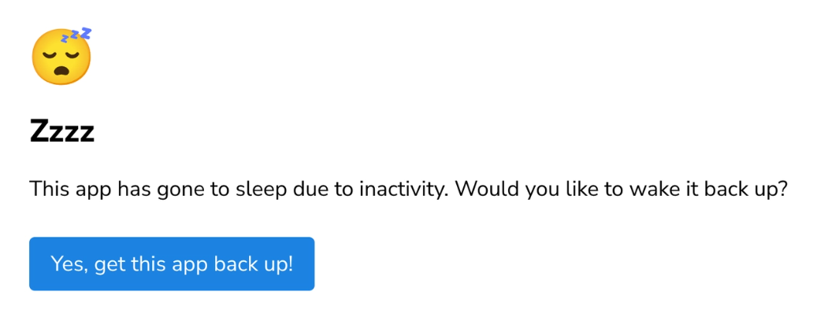
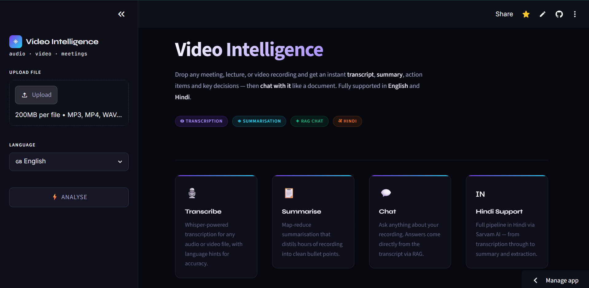
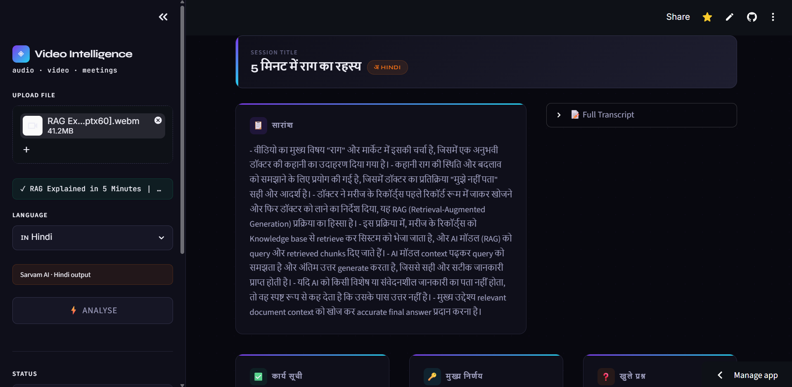

# AI Video Intelligence

An AI-powered application that transforms meeting recordings and videos into interactive knowledge bases. Upload an English or Hindi meeting/video, generate an AI-powered summary, and chat with the content using Retrieval-Augmented Generation (RAG).

## Live Demo

**Streamlit App:** https://ai-video-intelligence.streamlit.app/

> **Note:** The application is hosted on Streamlit Community Cloud. If the app has gone to sleep due to inactivity, simply click **"Get this app back up"** and wait a few moments for it to restart.

## Preview
    
### Home Page

### Chat Interface

## Features

* Upload meeting recordings or videos
* Supports **English** and **Hindi** audio
* Automatic speech-to-text transcription
* AI-generated meeting summaries
* Chat with your video using **Retrieval-Augmented Generation (RAG)**
* Context-aware question answering
* Vector database for semantic search
* Action Items,Key Decisions, Open Questions from the video

## Technologies Used

* Python
* Streamlit
* LangChain
* OpenAI
* Sarvam AI (Speech-to-Text)
* ChromaDB
* Retrieval-Augmented Generation (RAG)

## Use Cases

* Meeting summarization
* Interview analysis
* Lecture and webinar Q&A
* Video knowledge retrieval
* Team collaboration and documentation

